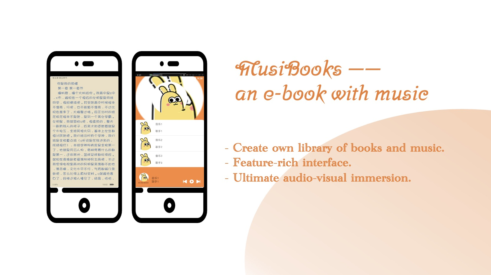

# MusiBook

**Books and music carry the space of the human soul.** Our Android app, MusiBook, breaks away from the current trend of e-books and music players turning into social platforms. It provides users with a **peaceful, immersive, and independent** spiritual space.

## Usage

1. Clone the repository: `git clone https://github.com/rachelxhoot/MusiBook.git`
2. Open the directories in Android Studio.
3. Build and run the application on an Android device or emulator.

Please click [here](https://www.notion.so/MusiBooks-an-e-book-with-music-3f8611750f7c4ed6828882c9b62eea3f) for more details!

